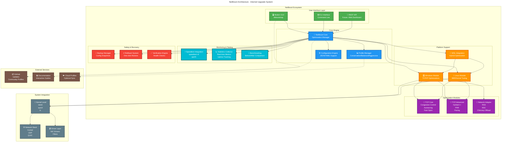

```mermaid
---
title: NetBoozt Architecture - Internet Upgrade System
---
graph TB
    subgraph "NetBoozt Ecosystem"
        subgraph "User Interface Layer"
            GUI[🖥️ Modern GUI<br/>ttkbootstrap]
            CLI[⌨️ CLI Interface<br/>Command Line]
            API[🔌 REST API<br/>Future: Web Dashboard]
        end
        
        subgraph "Core Engine"
            CORE[🎯 NetBoozt Core<br/>Optimization Manager]
            PROFILE[📊 Profile Manager<br/>Conservative/Balanced/Aggressive]
            CONFIG[⚙️ Configuration Engine<br/>JSON/YAML Support]
        end
        
        subgraph "Platform Support"
            WIN[🪟 Windows Module<br/>TCP/IP Optimizations]
            LIN[🐧 Linux Module<br/>BBR/Kernel Tuning]
            WSL[🔄 WSL Integration<br/>Hybrid Optimization]
        end
        
        subgraph "Optimization Modules"
            TCP[📡 TCP Core<br/>Congestion Control<br/>Autotuning<br/>Fast Open]
            ADV[🚀 TCP Advanced<br/>HyStart++<br/>PRR<br/>Pacing]
            NIC[🔌 Network Adapter<br/>RSS<br/>RSC<br/>Chimney Offload]
        end
        
        subgraph "Monitoring & Testing"
            SPEED[⚡ Speedtest Integration<br/>speedtest-cli<br/>iperf3]
            STATS[📈 Statistics Collector<br/>Real-time Metrics<br/>Uptime Tracking]
            BENCH[🎯 Benchmarking<br/>Before/After Comparison]
        end
        
        subgraph "Safety & Recovery"
            BACKUP[💾 Backup Manager<br/>Config Snapshots]
            ROLLBACK[↩️ Rollback System<br/>One-click Restore]
            VERIFY[✅ Verification Engine<br/>Health Checks]
        end
    end
    
    subgraph "System Integration"
        KERNEL[🔧 Kernel Level<br/>netsh<br/>sysctl<br/>tc]
        NETWORK[🌐 Network Stack<br/>TCP/IP<br/>UDP<br/>QUIC]
        DRIVER[💿 Driver Layer<br/>NIC Drivers<br/>Filters]
    end
    
    subgraph "External Services"
        GITHUB[📦 GitHub<br/>Updates<br/>Community Profiles]
        DOCS[📚 Documentation<br/>Interactive Guides]
        CLOUD[☁️ Cloud Profiles<br/>Optional Sync]
    end
    
    %% User Interactions
    GUI --> CORE
    CLI --> CORE
    API --> CORE
    
    %% Core Logic
    CORE --> PROFILE
    CORE --> CONFIG
    CORE --> WIN
    CORE --> LIN
    CORE --> WSL
    
    %% Platform to Modules
    WIN --> TCP
    WIN --> ADV
    WIN --> NIC
    LIN --> TCP
    LIN --> ADV
    WSL --> WIN
    WSL --> LIN
    
    %% Monitoring
    CORE --> SPEED
    CORE --> STATS
    CORE --> BENCH
    
    %% Safety
    CORE --> BACKUP
    CORE --> ROLLBACK
    CORE --> VERIFY
    
    %% System Integration
    WIN --> KERNEL
    LIN --> KERNEL
    KERNEL --> NETWORK
    KERNEL --> DRIVER
    
    %% External
    CORE -.-> GITHUB
    GUI -.-> DOCS
    PROFILE -.-> CLOUD
    
    %% Styling
    classDef userLayer fill:#4CAF50,stroke:#2E7D32,stroke-width:3px,color:#fff
    classDef coreLayer fill:#2196F3,stroke:#1565C0,stroke-width:3px,color:#fff
    classDef platformLayer fill:#FF9800,stroke:#E65100,stroke-width:3px,color:#fff
    classDef moduleLayer fill:#9C27B0,stroke:#6A1B9A,stroke-width:3px,color:#fff
    classDef monitorLayer fill:#00BCD4,stroke:#006064,stroke-width:3px,color:#fff
    classDef safetyLayer fill:#F44336,stroke:#B71C1C,stroke-width:3px,color:#fff
    classDef systemLayer fill:#607D8B,stroke:#37474F,stroke-width:2px,color:#fff
    classDef externalLayer fill:#795548,stroke:#4E342E,stroke-width:2px,color:#fff
    
    class GUI,CLI,API userLayer
    class CORE,PROFILE,CONFIG coreLayer
    class WIN,LIN,WSL platformLayer
    class TCP,ADV,NIC moduleLayer
    class SPEED,STATS,BENCH monitorLayer
    class BACKUP,ROLLBACK,VERIFY safetyLayer
    class KERNEL,NETWORK,DRIVER systemLayer
    class GITHUB,DOCS,CLOUD externalLayer
```
