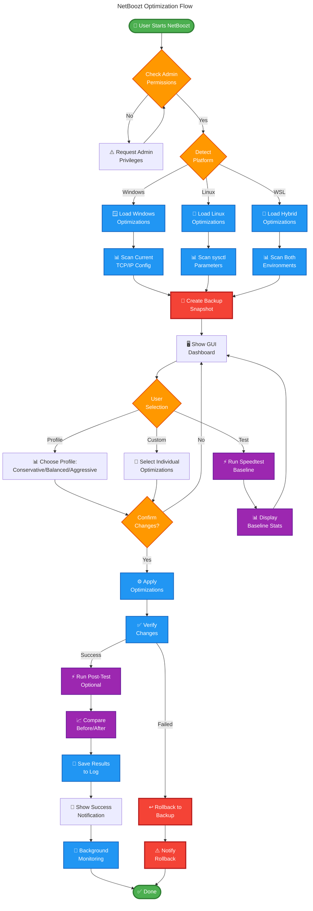

```mermaid
---
title: NetBoozt Optimization Flow
---
flowchart TD
    START([🚀 User Starts NetBoozt])
    
    START --> CHECK{Check Admin<br/>Permissions}
    
    CHECK -->|No| ELEVATE[⚠️ Request Admin<br/>Privileges]
    ELEVATE --> CHECK
    
    CHECK -->|Yes| PLATFORM{Detect<br/>Platform}
    
    PLATFORM -->|Windows| DETECT_WIN[🪟 Load Windows<br/>Optimizations]
    PLATFORM -->|Linux| DETECT_LIN[🐧 Load Linux<br/>Optimizations]
    PLATFORM -->|WSL| DETECT_WSL[🔄 Load Hybrid<br/>Optimizations]
    
    DETECT_WIN --> SCAN_WIN[📊 Scan Current<br/>TCP/IP Config]
    DETECT_LIN --> SCAN_LIN[📊 Scan sysctl<br/>Parameters]
    DETECT_WSL --> SCAN_WSL[📊 Scan Both<br/>Environments]
    
    SCAN_WIN --> BACKUP[💾 Create Backup<br/>Snapshot]
    SCAN_LIN --> BACKUP
    SCAN_WSL --> BACKUP
    
    BACKUP --> SHOW_GUI[🖥️ Show GUI<br/>Dashboard]
    
    SHOW_GUI --> USER_CHOICE{User<br/>Selection}
    
    USER_CHOICE -->|Profile| SELECT_PROFILE[📊 Choose Profile:<br/>Conservative/Balanced/Aggressive]
    USER_CHOICE -->|Custom| SELECT_CUSTOM[🔧 Select Individual<br/>Optimizations]
    USER_CHOICE -->|Test| RUN_SPEED[⚡ Run Speedtest<br/>Baseline]
    
    SELECT_PROFILE --> CONFIRM{Confirm<br/>Changes?}
    SELECT_CUSTOM --> CONFIRM
    
    CONFIRM -->|No| SHOW_GUI
    CONFIRM -->|Yes| APPLY[⚙️ Apply<br/>Optimizations]
    
    APPLY --> VERIFY[✅ Verify<br/>Changes]
    
    VERIFY -->|Success| POST_TEST[⚡ Run Post-Test<br/>Optional]
    VERIFY -->|Failed| ROLLBACK[↩️ Rollback to<br/>Backup]
    
    POST_TEST --> COMPARE[📈 Compare<br/>Before/After]
    
    COMPARE --> LOG[📝 Save Results<br/>to Log]
    
    LOG --> NOTIFY[🔔 Show Success<br/>Notification]
    
    NOTIFY --> MONITOR[📡 Background<br/>Monitoring]
    
    MONITOR --> END([✅ Done])
    
    ROLLBACK --> NOTIFY_FAIL[⚠️ Notify<br/>Rollback]
    NOTIFY_FAIL --> END
    
    RUN_SPEED --> DISPLAY_BASE[📊 Display<br/>Baseline Stats]
    DISPLAY_BASE --> SHOW_GUI
    
    %% Styling
    classDef startEnd fill:#4CAF50,stroke:#2E7D32,stroke-width:3px,color:#fff
    classDef decision fill:#FF9800,stroke:#E65100,stroke-width:2px,color:#fff
    classDef process fill:#2196F3,stroke:#1565C0,stroke-width:2px,color:#fff
    classDef critical fill:#F44336,stroke:#B71C1C,stroke-width:3px,color:#fff
    classDef test fill:#9C27B0,stroke:#6A1B9A,stroke-width:2px,color:#fff
    
    class START,END startEnd
    class CHECK,PLATFORM,USER_CHOICE,CONFIRM decision
    class DETECT_WIN,DETECT_LIN,DETECT_WSL,SCAN_WIN,SCAN_LIN,SCAN_WSL,APPLY,VERIFY,LOG,MONITOR process
    class BACKUP,ROLLBACK,NOTIFY_FAIL critical
    class RUN_SPEED,POST_TEST,COMPARE,DISPLAY_BASE test
```
